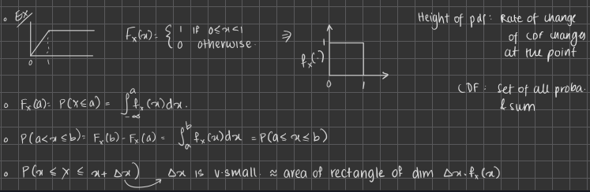

# Probability and Random Processes - Scribing assignment

## Professor : Prof. Lalitha Vadlamani

## Author : Ananya Sane, L Lakshmanan

## Lecture 9 notes

---

## Key Ideas in lecture 9

1. Lemmas for the CDF

2. Types of random variables

---

**Lemma :** For any $x \in R$

$P(X = x) = P(X \leq x) - P(X < x)$

Then, by continuity of probability,

$P(X = x) = F_X(x) - \displaystyle\lim_{\epsilon \to 0} F_X(x  -\epsilon)$

**Corollary :** $F_X()$ is left continuous iff $P(X = x) = 0 \ \ \forall \ \ x \in R$

This implies $F_X()$ is continuous iff $P(X = x) = 0 \ \ \forall \ \ x \in R$

### Types of random variables

- Continuous Random Variable
- Discrete Random Variable
- Mixed Random Variable

    **(Not done in class)**
    There is a fourth type of random variable called a SINGULAR random variable, that is a fundamentally different random variable. It is mostly only of academic interest as it does not have many applications. Any probability measure on the Real numbers can be broken down into these three fundamental components, i.e., Discrete, Continuous and singular.
  
#### Continuous Random variables

  A random variable X with CDF $F_X()$ is said to be continuous if $F_X()$ is continuous. In the context of continuous RVs, probabilities of intervals give useful info, as probabilities of points are always 0.

  If $F_X()$ is a differentiable function, then we can find another function for the continuous RV, which is defined as,
  $$f_X(x) = \frac{dF_X(x)}{dx}$$

  which is called the **probability density function**. We can integrate this function from $-\infty$ to whatever value we want to get the CDF.

  So we can say that
  $P(a \leq x \leq b) = \displaystyle\int_{a}^{b}f_X(x)\cdot dx$

  And from this, if we find $P(x \leq X \leq x + \Delta x)$ and make $\Delta x \to 0$, we can approximate it to a rectangle with area $f_X(x) \cdot \Delta x$.

Properties of a PDF

- $f_X(x) \geq 0$ (Because CDF is monotonically non decreasing)
- $\displaystyle\int_{-\infty}^{\infty}f_X(x)\cdot dx = 1$

*PDF by itself does not indicate any probability.*

#### Radon Nikodyn theorem (Not done in class)

Let X be a continuous RV. There exists a non negative measurable function $f_x() : R \to [0, \infty)$ such that for any B in the Borel sigma algebra, we have

$$P_X(B) = \displaystyle\int_{B} f_x\cdot d\lambda$$

This basically means for any Borel set, we can represent its probability law as the integral of a non negative function. As we have not done measure theory yet, we can understand it as an integration over the real line for our purposes. This is the basis for the equation that relates the CDF of continuous random variables to the PDF, i.e.,

$$P_X((-\infty, x]) = F_X(x) = \displaystyle\int_{-\infty}^{x} f_X(x) dx$$

#### Discrete Random Variables

X is said to be a discrete random variable if the range of X is either finite or countably infinite in R.

The CDF of a discrete random variable will look like a staircase, constant everywhere, with jumps at certain points.

Here, $P(X = x_i) > 0$, not necessarily, but possible.
CDF for this would be

$$F_X(a) = \displaystyle\sum_{x_i \leq a} P(X = x_i)$$

Now, $P(X = x_i) = P_X(x_i)$ for $x_i$ in the range of X.

$P_X()$ is called the **probability mass function**.

Properties of PMF:

- $P_X(x_i) \geq 0$

For S = range of X = $\{x_1, x_2, ...\}$

- $\displaystyle\sum_{x_i \in S} P_X(x_i) = 1$

---

## Lecture 13 Notes

---

## Key ideas in lecture 13

1. Variance
2. Examples and Properties of Discrete Random Variables
3. Examples and Properties of Continuous Random Variables

---

## Variance of a Random Variable

Variance can be understood as a quantity that represents the avergae variation of a R.V about the mean.
Given a R.V X, its variance is given by

$Var(X) = E[(X - E(X))^2] = E(X^2) - (E(X))^2$

If X is discrete, then

$E(X) = \mu$

$Var(X) = \displaystyle\displaystyle\sum_{x_i}(x_i-\mu)^2P_X(x_i)$

If X is continuous, then

$E(X) = \mu$

$Var(X) = \displaystyle\int_{-\infty}^{\infty}(x-\mu)^2f_X(x)dx$

### Properties of Variance

Variance is always $\geq0$, with equality iff the random variable is constant.

---

## Examples of Discrete Random Variables

### 1. Bernoulli Random Variables

- Defined by

    $P_X(x) = \begin{cases}p & for \ x=1\\1-p & for\ x=0\\0 & otherwise\end{cases}$

    where $0 < p < 1$.

    

- $E(X) = 0(1-p) + 1(p) = p$
  
- $Var(X) = (0-p)^2(1-p) + (1-p)^2(p) = p(1-p)$

- This random variable is mainly used to model random experiments that have two possible outcomes, which are sometimes referred to as "success" and "failure".

- The Bernoulli random variable is also called the **Indicator random variable**, which tells us if a particular event has occured or not.

### 2. Binomial Random Variables

- Experiment: Biased coin tossed $n$ times with probability of heads being $p$; outcomes mapped to $k$ where $k$ is the number of heads obtained.
- This variable can be represented as the sum of $n$ independent Bernoulli R.Vs.

- $P_X(x) = \begin{cases}{{n}\choose{k}} p^k(1-p)^{n-k} & for \ k=0, 1, 2, ... n\\0 & otherwise\end{cases}$

    

- $E(X) = \displaystyle\sum_{i=0}^{n}i{n \choose i}p^i(1-p)^{n-i} = np$
  
- $Var(X) =$  Sum of variances of $n$ Bernoulli variables $=nVar(X) = np(1-p)$

### 3. Geometric Random Variables

- Experiment: Toss a biased coin till a head is obtained. X is the position of the head.
- $P_X(k) = (1-p)^{k-1}p$

    

- $E(X) = \displaystyle\sum_{i=0}^{n}i(1-p)^{i-1}p = 1/p$
  
- $Var(X) =$  $E(X^2) - (E(X))^2=E(X^2) -1/p^2$

    $E(X^2) = \displaystyle\sum_{k=1}^{\infty}k^2p(1-p)^{k-1}=(2-p)/p^2$

- $\therefore Var(X) = (2-p-1)/p^2 = (1-p)/p^2$

### 4. Poisson Random Variables

- Used to model rare events
- $P_X(k) = \lambda^ke^{-\lambda}/k!$

    

- $E(X) = \lambda$
  
- $Var(X) =\lambda$

### 5. Pascal Random Variables (Not done in class)

- This R.V can be understood as a generalisation of the geometric distribution.

- Experiment: Biased coin with probability of heads being $p$ tossed repeatedly until $m$ heads are observed, $m \in \mathcal{N}$.

- As we can deduce from the above definition, a geometric variable is simply the case when $m = 1$ for a Pascal random variable.

- $P_X(x) = \begin{cases}{{k-1}\choose{m-1}} p^m(1-p)^{k-m} & for \ k=m, m+1, m+2....\\0 & otherwise\end{cases}$

    

- $E(X) = m/p$, can be derived by expressing it as the sum of multiple independent geometric random variables.

- $Var(X) = m\cdot (1-p)/p^2$

---

## Examples of Continuous Random Variables

### 1. Uniform Random Variables

- $f_X(x) = \begin{cases}1/(b-a) & for \ a\leq x\leq b\\0 & otherwise\end{cases}$

    

- $E(X) = (a+b)/2$
  
- $Var(X) = (b-a)^2/12$

### 2. Exponential Random Variables

- Used to model completion time
- $f_X(x) = \begin{cases}\lambda e^{-\lambda x} & for x\geq 0\\0 & otherwise\end{cases}$

    

- $E(X) = \displaystyle\int_{0}^{\infty}x\lambda e^{-\lambda x}dx=1/\lambda$
  
- $Var(X) = 1/\lambda ^2$

### 3. Gaussian Random Variables

- Used to model noise. It is a sum of many independent R.V.s
- $f_X(x) = \frac{1}{\sqrt{2\pi \sigma ^2}}e^\frac{-(x-\mu)^2}{2\sigma ^2}$
  
  

- $E(X) = \mu$
  
- $Var(X) = \sigma ^2$

---
