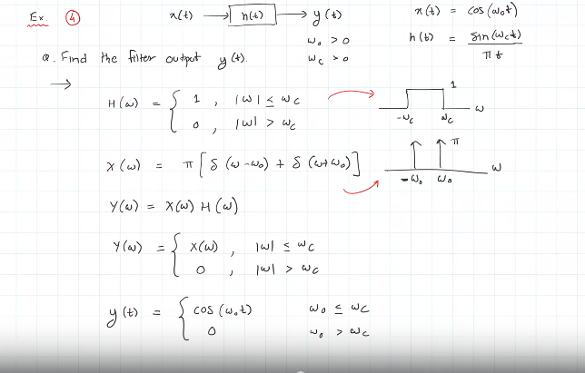

# Signal Processing Course

## 24 May 2021

---

- Intro stuff (course overview)

- What are signals? Examples? (Same definition as IC, only asked for intuition)

Signals studied will majorly include be functions of time, but time dependent signals are **NOT** the only kind, as noted in IC course notes today.

### Classification of signals

- Discrete time signals & Continuous time signals. -> Discrete time is represented as x[n], continuous time as x(t).
- Periodic and Aperiodic signals
- Even and Odd signals
- Analog and Digital signals
- Deterministic and Random signals

Discrete time and continuous time signals are differentiated according to the division of time, while analog signals and digital signals are differentiated according to the range of the values that the signal can attain. DO NOT confuse them.

**Signal Processing:** Signals are processed to extract information, represent them in different forms (transforms) and to modify signals when necessary. A system can be used to perform the required processing on a signal.

### Classification of systems

- Causal and non causal
- Linear and Non linear

---

## 26 May 2021

---

### Fourier series

- Periodic signals -> Represented as a weighted sum of sinusoids.
- Fourier series can be applied to both real and complex signals.

### Trigonometric Fourier Series representation

Synthesis equation:

 $\to x(t) = c_0 + \displaystyle \sum_{n = 1}^{\infty}(c_n \cdot cos(n\omega_0t) + b_n \cdot sin(n\omega_0t))$

where $\omega_0 = \frac{2\pi}{T}$.

Each of the terms in the infinite sum are called the harmonics, and $c_0$ is the constant/DC part of the function.\
**n = 1 IS CALLED THE FUNDAMENTAL COMPONENT AND NOT THE FIRST HARMONIC**

Called the synthesis equation as we can use it to *reconstruct* a signal with frequency $f_0$. If we only use a finite number of terms in the sum, then we get a function $x'(t)$ which will be an approximation of the original function.

**Reconstruction error** -> $e = x'(t) - x(t) \not ={0}$
When $e = 0$, we say that it is a *perfect reconstruction*.

- Determining coefficients for a given signal is *analysis*.
- Generating a periodic signal of frequency $f_0$ by progressively adding weighted harmonics to a sinusoid of frequency $f_0$ (Fundamental component) is *synthesis*.

### Exponential Fourier Series representation

Synthesis equation:

$\to x(t) = \displaystyle \sum_{k = -\infty}^{\infty}a_k \cdot e^{jk\omega_0t}$

To convert from exponential form, use $e^{j \theta} = \cos\theta + j\sin\theta$

Analysis equation:

$\to a_0 = c_0$ (from trigonometric series)

$\to a_k = \frac{1}{T} \cdot\displaystyle \left (\int_{<T>} x(t) \cdot e^{-jk\omega_0t}\;dt\right)$

Dot product of functions is the integral over their period in this case.

Analysis equation for $a_k$ actually comes from the logic behind projections of vectors (from NeSS), i.e.

$a_k = \frac{<x(t), e^{-jk\omega_0t}>}{<e^{-jk\omega_0t}, e^{-jk\omega_0t}>}$

 ***WORKS BECAUSE $\sin(n\theta)$ is orthogonal to $\sin(m\theta)$. Same for cosine. So every term that isn't having the same coefficient becomes 0 in the dot product, hence giving us the required component, which is the Fourier coefficient here.***

$a_k$ are the Fourier series coefficients. They are also called the spectral coefficients.

- Signal representation by orthogonal signal set (Comparison with basis decomposition of vectors, similar idea here, where sinusoids are the basis functions).
  
We represent $x(t)$ using orthogonal signals (Can be compared to basis vectors, sine and cosine functions here as mentioned above).

- Solving examples of Fourier series questions

***Fourier series is RESTRICTED TO periodic signals.***

## Fourier Transform

Consider an aperiodic signal $x(t)$.
Now consider a periodic extension $x_p(t)$ with period $T > 2T_1$ ($2T_1$ is time range of original signal)

That is,

$x_p(t) = x(t) + \displaystyle \sum_{n = 1}^{\infty}(x(t - nT) + x(t + nT))$

Now, we can find Fourier series coefficients of $x_p(t)$, as it is periodic. For this we can use the analysis equations.

Now, if we integrate from $\frac{-T}{2}$ to $\frac{T}{2}$, the only integrable portion is from $-T_1$ to $T_1$, i.e.,

$a_k = \frac{1}{T}\displaystyle \left (\int_{-\frac{T}{2}}^{\frac{T}{2}} x_p(t)\cdot e^{-jk\omega_0 t}\;dt \right)$

Here, as the function is aperiodic and the only integral part is from $-T_1$ to $T_1$, we can change the limits to $-\infty$ and $\infty$ to get $a_k$ and change $x_p$ to $x$ as well.

If we take $k\omega_0$ = $\omega$, we can define X($\omega$) as,

$X(\omega) = \displaystyle \left (\int_{-\infty}^{\infty} x(t)\cdot e^{-j\omega t}\;dt\right)$

where $\omega$ is a real continuous variable. This is the ***FOURIER TRANSFORM*** of $x(t)$. So according to this equation, we can say,

$X(\omega) = a_k\cdot T$

So, $X(\omega)$ is like the envelope of $a_k$.

Now, for the synthesis equations,

$\to x_p(t) = \displaystyle \sum_{k = -\infty}^{\infty}a_k \cdot e^{jk\omega_0t}$

Here, we can substitute $a_k$ with $\frac{X(k\omega_0)}{T}$. We can then substitute that $\frac{1}{T}$ with $\frac{\omega_0}{2\pi}$, hence resulting in the equation

$\to x_p(t) = \frac{1}{2\pi}\displaystyle \sum_{k = -\infty}^{\infty} X(k\omega_0) \cdot e^{jk\omega_0t} \cdot \omega_0$

If $T \to \infty$, $\omega_0 \to 0$. So, we can now make the summation an integration, that integration being (using $\omega = k\omega_0$),

$\to x(t) = \frac{1}{2\pi}\displaystyle \left (\int_{-\infty}^{\infty} X(\omega) \cdot e^{j\omega t} d\omega \right)$

To summarise,

- Analysis equation (Fourier Transform)
  
  $X(\omega) = \displaystyle \left (\int_{-\infty}^{\infty} x(t)\cdot e^{-j\omega t}\;dt\right)$

- Synthesis equation (Inverse Fourier Transform)

    $x(t) = \frac{1}{2\pi}\displaystyle \left (\int_{-\infty}^{\infty} X(\omega) \cdot e^{j\omega t} d\omega \right)$

- Fourier transform applies to general aperiodic signals.

---

## 28 May 2021

---

## Fourier Transform, continued

- Both time and frequency are continuous variables here, whereas frequency was discrete in Fourier series.
- Fourier transform is basically derived from a limiting case of Fourier series.
- Fourier Transform is a weighted linear combination (integration, instead of summation like in Fourier series) of complex sinusoids.
- In general, all frequencies are present in the transform, i.e., integration goes from $-\infty$ to $\infty$.
- $X(\omega)$ quantifies the contribution of $e^{j\omega t}$, similar to $a_k$ in Fourier Series.
- $X(\omega)$ is complex valued in general.
- Notation : $X(\omega) \longleftrightarrow x(t)$

What the Inverse Fourier Transform basically does is:

- Multiplies the given frequency domain signal by sinusoids($-\infty\to\infty$) according to their frequency.
- Adds them all up to give us our signal in time domain.

**Dirac delta function ($\delta(t)$) or unit impulse signal:**

- $\delta(t) = 0\  when\ t \not ={0}$
  
- $\displaystyle \left (\int_{-\infty}^{\infty}\delta(t) \ dt \right) = 1$

Main use of $\delta(t)$ is the sifting property, which is,

- $x(t)\cdot\delta(t - t_0) = x(t_0)\cdot\delta(t - t_0)$

- $\displaystyle\int_{-\infty}^{\infty}\delta(t - t_0) \cdot x(t) \ dt = x(t_0)$

**Gibbs' Phenomenon :** This phenomenon is the existence of an overshoot in the Fourier sum of a signal when there is a jump discontinuity. This error does not go away as more errors are added to the sum. However, the error does decrease in width and energy on taking more terms into consideration.

- A square wave in time has a sinc ($\frac{2\sin(\omega t)}{\omega}$) function as its Fourier transform. Graph of a sinc function is like a *single slit diffraction pattern* (Middle band is twice as big and stuff).
- Did example qs for Fourier Transform.

---

## 31 May 2021

---

Note: All double sided arrows imply FT here, or FS in a few places.

The Fourier Transform can be mapped to the Fourier series too.

Q. Consider the following Fourier Transform,

$X(\omega) = \displaystyle\sum_{k = -\infty}^{\infty}2\pi a_k\delta(\omega - k\omega_0)$

find $x(t)$.

Using the Inverse FT formula, 

$\to$ $x(t) = \frac{1}{2\pi}\displaystyle\int_{-\infty}^{\infty}X(\omega)\cdot e^{j\omega t} d\omega$

The foruier series only exists for periodic $x(t)$.

## Properties of Fourier Transform

- Linearity:
$x(t) \longleftrightarrow X(\omega)$ ; $y(t) \longleftrightarrow Y(\omega)$

$\implies \alpha x(t) + \beta y(t) \longleftrightarrow \alpha X(\omega) + \beta Y(\omega)$

- Time shift:
$x(t) \longleftrightarrow X(\omega)$

$\implies x(t - t_0) \longleftrightarrow X(\omega)\cdot e^{-j\omega t_0}$

Basically a phase shift.

- Time and Frequency Scaling:
$x(t) \longleftrightarrow X(\omega)$
$x(at) \longleftrightarrow \frac{1}{|a|}X(\omega / a)$

Makes sense intuitively, as an increase in time should result in a decrease in frequency, and vice versa.

Then a discussion about playback speeds on YT, so higher speeds imply the same voice needs to be fit into a shorter span of time, hence frequency needs to be increased. So, we get higher pitched voices and stuff (As I've noticed). Similarly, slowing down creates a lower frequency, which adds bass, hence the weird droning and hilarious playbacks at 0.25x. As for a physical representation of the constant a, the energy of a signal changes when it is compressed???? Should it not increase in frequency if I compress it in time? Will need to clarify.

---

## 2 June 2021

---

**Note:** Fourier Transform is a special case of Laplace transform.

|Laplace transform|Fourier Transform|
|---              |---              |
|$x(t) \longleftrightarrow X(s)$|$x(t) \longleftrightarrow X(\omega)$ |
|s is a complex variable.|$\omega$ is a real variable.|
|$X(s) = \displaystyle \int_{-\infty}^{\infty} x(t) \cdot e^{-st}dt$|$X(\omega) = \displaystyle \int_{-\infty}^{\infty} x(t) \cdot e^{-\omega t}dt$|
|$s =\sigma + j\omega$ | When $\sigma = 0$ in Laplace transform|
|Region of Convergence (ROC): Region of s plane where that integral converges.| Imaginary axis in s plane|

Trying to solve a known transform in reverse...

$\delta(t) \longleftrightarrow 1$. Starting from $X(\omega)$, find $x(t)$.
Using synthesis formula, we get,

$x(t) = \frac{1}{2\pi}\displaystyle\int_{-\infty}^{\infty} X(\omega)e^{j\omega t}d\omega$
$= \frac{1}{2\pi}\displaystyle\int_{-\infty}^{\infty}e^{j\omega t}d\omega$
Here we are at a fix, as we cannot simplify frther, as it would give undefined values.
So signals may not have a converging integral at all times. We must take this into consideration too.

Now, if we take the Fourier transform of $cos(\omega_0t)$, we still get $\pi[\delta(\omega - \omega_0) + \delta(\omega + \omega_0)]$. But here if we try to find the ROC, we find that the imaginary axis is not a part of it. So it does not converge. The transform will be 2 poles in the S plane. So when we try going forwards from $cos(\omega_0t)$, we get stuck.
As I understand it, any function that has a transform that contains a $\delta$ function will not cnoverge as it is not well defined.

**Continuing with properties of the Fourier Transform...**

- Parseval's theorem:
  Energy is same in time and frequency domains upto a scaling factor.
  i.e.
  $\displaystyle\int_{-\infty}^{\infty}|x(t)|^2 dt = \frac{1}{2\pi} \displaystyle\int_{-\infty}^{\infty}|X(\omega)|^2 d\omega$

- Symmetry and Conjugacy properties:
  $x(t) \longleftrightarrow X(\omega)$
  $x(-t) \longleftrightarrow X(-\omega)$  (Can be derived from scaling property too)
  $x^*(t) \longleftrightarrow X^*(-\omega)$
  From these, we can derive,
  - If $x(t)$ is real,
  $x(t) = x^*(t) \implies X(\omega) = X^*(-\omega)$ from first and third points.
  This is called conjugate symmetry.

  - If $x(t)$ is even,
  $x(t) = x(-t) \implies X(\omega) = X(-\omega)$ from first and second points.
  - If $x(t)$ is odd,
  $x(-t) = -x(t) \implies X(-\omega) = -X(\omega)$ from first and second points.
  - Differentiation in time:
    $\frac{d(x(t))}{dt} \longleftrightarrow j\omega X(\omega)$
  - Differentiation in frequency:
    $tx(t) \longleftrightarrow \frac{d(X(\omega))}{d\omega}$
  - Frequency shift (Analogous to time shift)
    $x(t)e^{j\omega_0 t} \longleftrightarrow X(\omega - \omega_0)$

---

### Linear Time Invariant (LTI) Systems

Many systems can be represented as LTI systems, like RLC circuits are LTI systems.
Any system with a differential equation representation is an LTI system.
Examples of non LTI systems:

- Transistors
- Op amps
- Diodes
- Any digital system
  
**Linearity:**
$x_1(t) \to y_1(t)$ and $x_2(t) \to y_2(t)$

$\implies \alpha x_1(t) + \beta x_2(t) \to \alpha y_1(t) + \beta y_2(t)$

**Time invariance:**
$x(t) \to y(t)$

$\implies x(t - t_0) \to y(t - t_0)$

Any LTI system can be uniquely and fully characterised by its impulse response, i.e., the response it gives when the input is an impulse.

$\delta(t) \to h(t)$, where $h(t)$ is the impulse response of the system.

Given an arbitrary input $x(t)$ to an LTI system with impulse response $h(t)$, the output of the system will be an CONVOLUTION,

$y(t) = x(t) * h(t) = \displaystyle\int_{-\infty}^{\infty}x(\tau)h(t-\tau)d\tau$  

where $x(t) * h(t)$ is $x(t)$ CONVOLVED with $h(t)$.

Intuition for convolution:

The first $x(t)$ expression in the above image is a weighted linear representation of the given signal using shifted impulses.

---

## 4 June 2021

---

This is what we learned about LTI systems in the previous class.

### Properties of convolution

- Commutativity
  $x_1(t) * x_2(t) = x_2(t) * x_1(t)$

- Distributivity
  $h(t)*[x_1(t) + x_2(t)] = h(t)* x_1(t) + h(t) * x_2(t)$

- Associativity
  $x_1(t)*[x_2(t) + x_3(t)] = [x_1(t)*x_2(t)] + x_3(t)$

**Frequency analysis of LTI systems:**

If we give a complex sinusoid as input to an LTI system, i.e., $x(t) = e^{j\omega_0 t}$, we get a scaled sinusoid with the same frequency.
Working shown below.

So the complex sinusoid is an EIGENFUNCTION, and the Fourier transform $H(w_0)$ is the EIGENVALUE.

If we give a periodic signal as input to an LTI system, the same happens, as we can represent all periodic signals as a sum of complex sinusoids by their Fourier Series representation. If $x(t)$ is a periodic function, 

$x(t) = \displaystyle\sum_{k = -\infty}^{\infty} a_k e^{j\omega_0 kt}$

On convolving with impulse response $h(t)$, we get

$y(t) = \displaystyle\sum_{k = -\infty}^{\infty} a_k \cdot H(k\omega_0) e^{j\omega_0 kt}$

Cosine can be represented as the sum of complex sinusoids too, in the same way of course.
Working shown below

As seen, the final function is just scaled and phase shifted.

Note, 
$|H(\omega)| \to$ Magnitude response
$\angle H(\omega) \to$ Phase response ($\theta$ in the above image)

An LTI system NEVER adds frequencies. Only propagates or removes existing frequencies. This can be used as a criteria to find LTI systems. Proof is given a few lines from now.

If we give a general aperiodic signal as input, the FT is found by...

- Convolution property Fourier transform:
  
  If $x(t)*h(t) = y(t)$, then
  $X(\omega) \cdot H(\omega) = Y(\omega)$.

  Here, a convolution is converted into a multiplication by FT. This eases calculation by a lot. Now we can apply IFT to $Y(\omega)$ and get $y(t)$ which is what we need. Proof is pretty straightforward. $H(\omega)$ is the frequency response of the LTI system.

  From here we can say that if $X(\omega)$ is zero at any frequency, $Y(\omega)$ is NECESSARILY zero there too, so an LTI system cannot add frequencies to a given signal.

Did problems on convolution.

Ex 1: A delay system, no need for properties

Ex 2: A derivative system

This system ~~boosts~~ SCALES the weights of the frequencies.

---

## 7 June 2021

---

LTI systems can be interpreted as ***Frequency selective filters***. Mainly because $H(\omega)$ can nullify any frequencies by having that component with zero wieght, hence excluding that frequency from the final output.
Example q to demonstrate Convolution property:

An example q that shows how a sinc function acts as a filter.

Pretty straightforward.
This is an ideal low pass filter.

A high pass filter is just that graph reversed.

A band pass filter is like a collection of bands that are allowed, and the rest which are blocked.

We cannot design an ideal low pass filter, as a sinc function is infinte, i.e., it's unbounded and extends for infinite time, and hence requires an infinite convolution, which we don't have the resources for. It's also unstable? Idk what that really means, but apparently it's unstable, i.e, a bounded input may give an unbounded output, and so we don't do it.
We can design filters that can give something close to an ideal filter, and deal with it.

---

## 9 June 2021

---

### Analysis of a series RC circuit (using Fourier transform)

The differential eqn for an RC system is

$$V_{in}(t) - RC\frac{dV_{out}}{dt} = V_{out}(t)$$

Taking Fourier Transform of this,

$$V_{in}(\omega) - RCj\omega V_{out}(\omega) = V_{out}(\omega)$$
$$\implies V_{out}(\omega) = \frac{1}{1 + j\omega RC}V_{in}(\omega)$$

As seen, this will attenuate the higher frquencies, as it is inversely proportional to $\omega$.

So,

$$H(\omega) = \frac{\frac{1}{RC}}{\frac{1}{RC}+j\omega}$$

So, using standard fourier transform formulae, we can get

$h(t) = \frac{1}{RC} e^{-t/RC}u(t)$

The plots for those functions are as given below.

**Multiplication property:**

$$x(t) \leftrightarrow X(\omega) \ and \ y(t) \leftrightarrow Y(\omega)$$
$\implies x(t)y(t) \longleftrightarrow \frac{1}{2\pi}[X(\omega)*Y(\omega)]$

This is basically the reverse of the convolution property. Also called modulation property. This finds use because while multiplication with impulses is difficult, convolution is very easy.

Example question

This is an example of amplitude modulation. As we can see, the amplitude has decreased. In the above case, cosine is the carrier signal, and the weird thing is the message signal.

For demodulation, we just multiply the received signal with the same carrier wave.

We'll need to scale it as required. Low pass filter to get that middle copy.

---

## 11 June 2021

---

### Sampling Theorem

It's a link between continuous time signals and discrete time signals.
Matlab plots graphs by discretising the input, as continuous time computation is not possible, hence the time_grid thing.

We can take infinite samples of a signal, but then this is practically not useful, so we need a limit. We need to take a certain amount of samples so that we have enough to reconstruct the signal when necessary.
We do this because we can use it for:

- Compression
- Storage or transmission
- Computations

Fourier series is a discrete representation of periodic signals.

For a general aperiodic signal though, we sample its value at cerain instants of time and "join the dots". For this, we need to have enough samples, or we cannot have a definitive reconstruction of the signal.

We can reconstruct a band limited signal perfectly.

**Band limited singal:** A signal $x(t)$ is band limited if there is a frequency $\omega_m$ such that the FT $X(\omega)$ is zero for $|\omega| > \omega_m$. Ex: speech signals only extend upto a certain frequency.

**Sampling theorem**

A Band limited signal with some maximum frequency $\omega_m$ can be perfectly recovered/reconstructed from its samples if the sampling frequency $\omega_s$ satisfies
$$\omega_s > 2\omega_m$$

We also call $2\omega_m$ as the NYQUIST RATE of the signal.

Sampling interval is defined as

$T_s = \frac{2\pi}{\omega_s}$

Intuitively speaking, this is because when a signal has higer frequency, it varies quickly, which means we need more samples in any region when compared to a signal with a lesser frequency.

If the signal is not band limited, there is no limit on how high its frequency can go, hence, we can never PERFECTLY reconstruct it, but we can get a good approximation in a few cases (Idk if it's a few or many, but you can).

Proof: We use an impulse train to do the sampling.

$p(t) = \displaystyle\sum_{k = -\infty}^{\infty}\delta(t - kT_s)$

Now, we sample $x(t)$.

$$x(t) \longleftrightarrow x[k] = x(kT_s)$$

We use impulse train only for analytical proofs.

To sample, we multiply,

$x_p(t) = x(t)\cdot p(t)$

which gives us

$x_p(t) = \displaystyle\sum_{-\infty}^{\infty} x(kT_s)\delta(t - kT_s)$

---

## 14 June 2021

---

Time limited signals may or may not be recoverable from sampling, they may not be band limited.

Periodic signals may not be recoverable from their samples, as periodic signals can potentially have infinite harmonics, which we cannot sample.

Continuing from last class...

If we use multiplication property on $x_p(t)$ after converting it to frequency domain, we get

$$X_p(\omega) = \frac{1}{2\pi}X(\omega)*P(\omega)$$

which gives us

$$X_p(\omega) = \frac{1}{2\pi}X(\omega)*\frac{2\pi}{T_s}\displaystyle\sum_{-\infty}^{\infty}\delta(\omega - k\frac{2\pi}{T_s})$$

which simplifies to,

$$X_p(\omega) = \frac{1}{T_s}\displaystyle\sum_{-\infty}^{\infty}X(\omega - k\frac{2\pi}{T_s})$$

which is an infinite chain of **SCALED COPIES** of $X(\omega)$.

Diagrammatically,

As we can see from the figure, a lot of info seems to be lost in the time domain, but an exact scaled copy of the original signal is still there in the frequency domain, we can now use a suitable low pass filter to obtain our signal and then we can scale it as required.

The system that does the convolution is not LTI. A simple way of confirming that it is not LTI is as it creates multiple copies of the same signal at different frequencies, but we know that an LTI system cannot add new frequencies to a given signal.

The Nyquist rate is basically defined to prevent any overlaps between those copies. Overalapping causes aliasing.
As seen from the picture, we get the inequality,

$$\frac{2\pi}{T_s} - \omega_m > \omega_m$$

to prevent overlaps. This directly gives us the Nyquist rate condition. Hence proved.

Now this reconstruction is in frequency domain. We want reconstruction in time domain too.

Low pass filtering in frequency domain is basically multiplication. So this is equivalent to convolution in time domain.

So,

$$x_r(t) = x_p(t) * h_{LPF}(t)$$

**Ideal Reconstruction**

If we take an ideal LPF, we get $h_{LPF}(t)$ as the sinc function.

$h_{LPF}(t) = T_s\frac{sin(\omega_c t)}{\pi t}$

Now, convolving,

$\omega_c$ here is the cutoff frequency of the filter.
This ideal reconstruction is basically a combination of weighted and shifted sinc shapes. An ideal reconstruction uses infinite sinc shapes.

THIS IS CALLED SINC INTERPOLATION.

**Non ideal reconstructions**

- Zero order hold reconstruction
  This basically takes the sample and holds its value till the next sample, and so on, so the graph looks a little like steps if the samples are spaced out.

- Linear interpolation (Connect   the dots with lines)
  Just connect the obtained samples with straight lines.

---

## 16 June 2021

---

For real signals, we can ignore the negative frequency spectrum and modify the graph to make it smaller and stuff.

- Zero Order Hold reconstruction (Piecewise constant approximation)
  h(t) is just a rectangular pulse from 0 to Ts. On convolving, it will hold the value till Ts, and then take the next sample's value and so on.
  This is basically using a non ideal low pass filter instead of an ideal low pass filter.

  

- Linear interpolation (First order hold)
  Take a triangular pulse instead of a rectangular pulse here, from -Ts to Ts. The fourier transform of a triangular pulse is a squared sinc function, as it is formed by the convolution of two rectangular pulses. This is a better non ideal filter.

### Aliasing (Spectral folding)

When the copies overlap, i.e. when we take a sampling frequency lower than the Nyquist rate. We ideally don't want aliasing to happen.
High frequencies will appear at lower frequencies, basically they occur a little sooner than they are supposed to.
If the signal is not band limited, no matter how high our sampling rate is, we will not be able to reconstruct it perfectly because of aliasing.

Solution is to use an anti aliasing filter.
This just means pass the input signal into a low pass filter before sampling, where the filter has a cutoff frequency of $\omega_s/2$. This is basically forcing the signal to be band limited. This of course, will not be the same signal, but it will not undergo aliasing. This is what happens in those videos of cars and stuff, where the wheels seem to slow down after a while even though the car speeds up, because we aren't sampling quick enough. At exactly double the frequency, i.e. when the car has an rpm exactly double of our sampling rate, the wheels will appear stationary. This is an example of aliasing.

---

## 18 June 2021

---

Recap

Analog to digital conversion is actually more than one step. One of them is sampling, the sampled values are then **quantised**. Quantisation is basically the discretization of the sample values, along with encoding, i.e. mapping them to bit sequences. ADC takes samples and converts them to binary values and outputs them. More bits implies better resolution. There is an error as we are mapping a certain continuous range to a single bit sequence. DAC takes the proccessed input and using the quantised values, it gives us analog signals.

Bitrate can be defined as,

$$b_s = B\cdot f_s$$

Where $B$ is the number of bits used in the quantisaton of samples, and $f_s$ is the sampling rate in Hz. We won't worry about quantisation here after this point, use it as a black box ig.

### Discrete time signals

In x[n], n is necessarily an integer.

Examples:

- Unit impulse: $\delta[n]$, defined as 1 at n = 0, and 0 for all other points.

- Unit step: $u[n]$ is 1 $\forall n \geq 0$ and 0 everywhere else.

- Sinusoids: $x[n] = sin(\omega_0 n)$
  Similar for cosine.

- Exponentials: $x[n] = a^{n}, a \in R$

---

## 21 June 2021

---

Complex exponentials and sinusoids revision

Energy $\to\displaystyle\sum_{-\infty}^{\infty} |x[n]|^2$
If energy of a signal is finite, the signal is called an energy signal.

Power $\to\displaystyle\lim_{N \to \infty}\frac{1}{2N+1}\sum_{-N}^{N} |x[n]|^2$
If power of a signal is finite,the signal is called a power signal.

Even signals: $x[-n] = x[n]\ \forall n$
Odd sgnals: $x[-n] = -x[n]\ \forall n$
This implies $x[0] = 0$ for an odd signal.

Periodic signals: A signal is periodic if

$$x[n + N] = x[n] \ \forall \ n \ and \ N > 0$$
Smallest period of the signal $\to N$, called fundamental period.

Ex: $sin(5\pi n)$
$\to sin(5\pi (n + N)) = sin(5\pi n)$
$\implies 5\pi N = \pi k, k \in Z$
$\implies N = \frac{k}{5}$
$\implies N = 1$ is the smallest period.

Frequency = $\frac{1}{N}$

Ex2: $cos(5\pi n)$
$\to cos(5\pi (n + N)) = cos(5\pi n)$
$\implies 5\pi N = 2\pi k, k \in Z$
$\implies N = \frac{2k}{5}$
$\implies N = 2$ is the smallest period.

In general, for signals like $sin(\omega_0 n), cos(\omega_0 n), e^{j\omega_0 n}$ we can say that

$sin(\omega_0 n)$
$\to sin(\omega_0 (n + N)) = sin(\omega_0 n)$
$\implies \omega_0 N = 2\pi k, k \in Z$
$\implies \omega_0 = \frac{2\pi k}{N}$ for periodicity.

For example, if we take $cos(5n)$, as 5 does not satisfy that condition for any integers k and N, we can say that it is not periodic in discrete time.

---

## 23 June 2021

---

- $e^{j\omega n} \to$ Highest frequency = $\plusmn pi$, Lowest frequency = 0.

### Discrete time LTI systems (Also called LSI, S for shift)

Systems that follow are linear and time/shift invariant, just like in continuous time.

- Linearity:
  $x_1 \to y_1, x_2 \to y_2 \implies \alpha x_1 + \beta x_2 \to \alpha y_1 + \beta y_2$

- Time invariance:
  $x[n] \to y[n] \implies x[n - n_0] \to y[n - n_0]$

Examples:

- $y[n] = x[n-n_0]$, is LTI.
- $y[n] = x^2[n]$, is time invariant only.
- $y[n] = x[n] + x[n-1]$, is LTI.
- $y[n] = nx[n]$, is only linear.

**Representing signals using impulses**

$x[n] = x[0]\delta[n] + x[1]\delta[n - 1] + x[-1]\delta[n + 1]......$

Impulses in discrete time are well behaved, and are just equal to one, not tending to infinity or something.

**Impulse response of LTI system**

$\delta[n] \to h[n]$ in LTI system.

So, from this we can say that on passing a function into an LTI system, we get

$y[n] = \displaystyle\sum_{-\infty}^{\infty} x[k]h[n-k]$

$y[n] = x[n] * h[n]$

That summation is the convolution sum.

Properties of convolution $\to$ commutative, associative, distributive.

Unit impulse (discrete time) properties

- $x[n]\delta[n-k] = x[k]$
  
- $x[n]*\delta[n-k] = x[n-k]$

- $x[n]*\delta[n] = x[n]$
  
### Discrete time Fourier Transform (DTFT)

Analogous to continuous time Fourier transform.

We define the DTFT of a function $x[n]$ as

$$g(\omega) = \displaystyle\sum_{-\infty}^{\infty} x[n]e^{-j\omega n}$$

---

## 25 June 2021

---

Notice that the DTFT for any signal is periodic with period $2\pi$. As shown below,

$g(\omega + 2\pi) = \displaystyle\sum_{-\infty}^{\infty} x[n]\cdot e^{-j(\omega+2\pi) n} = \sum_{-\infty}^{\infty} x[n]\cdot e^{-j\omega n} \cdot e^{-j2\pi n} = \sum_{-\infty}^{\infty} x[n]\cdot e^{-j\omega n} = g(\omega)$

Nice table:

Proof for synthesis:

This can be compared to impulse train sampling, as impulse train sampling also made copies of the signal.

Ultra cool map that's kinda confusing:

DTFT can also be compared to Fourier Series. It's like the reverse, because here, frequency is continuous, and we have a perioic signal in frequency domain. In FS, we get a periodic and continuous signal in time domain. We also have discrete time in DTFT, while we have discrete frequencies in FS.

---

## 28 June 2021

---

Organization of Fourier Analysis:

Standard signals and their DTFT:

- $\delta[n] \longleftrightarrow 1$

- $\delta[n - n_0] \longleftrightarrow e^{-j\omega n_0}$
  
- Unit impulse in frequency (Impulse train, because it has to be periodic)
  $X(e^{j\omega}) = \displaystyle\sum_{k = -\infty}^{\infty} \delta(\omega - 2\pi k)$

  So,
  $x[n] = \frac{1}{2\pi}\displaystyle\int_{-\pi}^{\pi}X(e^{j\omega})e^{j\omega} d\omega$
  
  $\implies x[n] = \frac{1}{2\pi} \forall n$

- Shifted impulse in frequency
  Like before (still impulse train, but we find for one time period, also like before)

  $\delta(\omega - \omega_0) \longleftrightarrow \frac{1}{2\pi} e^{j\omega_0 n}$

- One sided exponential
  
  $x[n] = a^nu[n], |a| < 1$

  Its DTFT is
  $x[n] \longleftrightarrow \frac{1}{1-ae^{-j\omega}}$

  From this we get

  $|X(e^{j\omega})| = 1/\sqrt{1 + a^2 - 2acos(\omega)}$

  On plotting this for positive a and negative a, we get
  

  As we can see, we can use the negatove a graph as a non ideal high pass filter, and the positive a graph as a non ideal low pass filter, as done in lab.

- Rectangular pulse in frequency, given below
  
  
  

---

## 30 June 2021

---

Continuing from last class...

- Rectangular pulse in time
  
  Derived below.
  
  This is like a periodic sinc, with period $2\pi$, and is real valued.

**Discrete time LTI systems analysis using DTFT**

When $x[n] = e^{j\omega n}$,

$y[n] = x[n] * h[n] = \displaystyle\sum_{-\infty}^{\infty} x[k]h[n-k]$

Substituting x[n],

$y[n] = \displaystyle\sum_{-\infty}^{\infty} e^{j\omega k}h[n-k]$

$\implies y[n] = \displaystyle\sum_{-\infty}^{\infty} e^{j\omega (n-m)}h[m]$

$\implies y[n] = e^{j\omega n}\displaystyle\sum_{-\infty}^{\infty} e^{-j\omega m}h[m]$

$\implies y[n] = H(e^{j\omega})e^{j\omega n}$

Thus, complex exponents are eigenfunctions.

- Convolution property
  
  $x[n]*h[n] = y[n]$

  $Y(e^{j\omega}) = X(e^{j\omega})\cdot H(e^{j\omega})$

The frequency selectivity of an LTI system is determined by its frequency response $H(e^{j\omega})$. We usually pay attention to the magnitude response, which is $|H(e^{j\omega})|$.

Filters:

- Ideal LPF and HPF:
  Graph of Magnitude response
  

  Their graphs will be sampled sincs in time domain.

- All pass filter:
  $h[n] = \delta[n - n0]$, magnitude response is just a constant.

- Non ideal filters
  Did these filters in lab.

  - Moving average filter (Non ideal low pass filter)
  - Digital differentiator filter (Non ideal High pass filter)
  
  The plot for the magnitude responses of these filters allows us to find the nature of their filtering.

---

## 2 July 2021

---

Properties of DTFT

- Convolution
- Linearity
- Time shift
- Frequency shift
- Symmetry
- Differentiation in Frequency
- Parsevals relation
  
  $\displaystyle\sum_{-\infty}^{\infty}|x[n]|^2 = \frac{1}{2\pi}\int_{-\pi}^{\pi} |X(e^{j\omega})|^2 d\omega$

- Multiplication property
  
  $y[n] = x_1[n]\cdot x_2[n]$

  $\implies Y(\omega) = \frac{1}{2\pi}\displaystyle\int_{-\pi}^{\pi} X_1(\theta)\cdot X_2(\omega-\theta) d\theta$

  Regular convolution will not work, as the integral may tend to infinity.

### Discrete Fourier Transform (DFT)

DFT is very machine friendly.
Consider a finite sequence $x[n], n\in \{0, 1, 2..., N-1\}$.

We can sample the DTFT of the sequence at $\omega_
k = 2\pi k/N, k = 0, 1, ..., N-1$. This gives us

$X[k] = \displaystyle\sum_{n = 0}^{N-1}x[n]\cdot e^{-j\omega_k n}$ (Because the rest are 0).

This is the DFT of the N length sequence x[n].

Inverse DFT is getting x[n] from X[k].
Consider

$S_m = \displaystyle\sum_{k=0}^{N-1} X[k]e^{j2\pi kn/N}$. On substituting the formula for X[k], we get

**DFT is an orthogonal transformation.**

Derivation for impulse train:

---

## 5 July 2021

---

Recap:

### DFT as linear combination of signals

A DFT can be understood as a linear combination of complex sinusoids of the form $e^{j2\pi kn/N}$, with n as the time variable.

Time period for all these signals is N (not necessarily the fundamental period). Here, we only have a finite set of signals to linearly combine,as it is discrete.

### Periodicity of DFT

$X[k + N] = X[k]$

$x[n + N] = x[n]$
This works if we want to extend the intial n length sequence periodically.
Bascially when we sample the DTFT, we get a periodic discrete signal in frequency domain. This sampling is done by multiplying the DTFT by an impulse train. 

So, we can use convolution property here, which says that this will be equivalent to convolution in time domain, with another impulse train (as DFT of impulse train is impulse train). This gives us our periodic time domain signal, which is basically copies of our original n point time domain signal.

We also NEED a minimum of n points in our DFT, anything less than that would cause aliasing in time domain, but anything more is good. More would give us spaces in between the copies. Shown below:

### DFT as an orthogonal linear transformation

$X = F_N \cdot x$, where $F_N$ is a matrix.

Let $W_N = e^{-j2\pi/N}$. With this, we can derive $F_N$.

Clearly, $(F_N)_{k, n} = W_N^{kn}$. Using this, if we fill in the matrix of $F_4$ for example, we get

The $W_N$s used are called **twiddle factors**. As we can see from the image above, $F_2$ has a very simple structure, and we exploit this structure in the implementation of an efficient algorithm for calculating the DFT of a sequence called the Fast Fourier Transform, or the FFT.

The inverse DFT can be calculated as shown above in the image.

Ex :

Ex 2:

---

## 7 July 2021

---

Recap of DFT till now:

---

## 16 July 2021

---

### Z transform

Z transform is a generalisation of DTFT, like Laplace transform is a generalisation of Fourier Transform.

$e^{-j\omega t} \ (FT) \to e^{-\delta t} \ (\delta = \sigma + j\omega) \ (Laplace \ Transform)$

$e^{-j\omega n} \ (DTFT) \to z^{-n} \ (z = re^{j\omega}) \ (Z- Transform)$

The Z transform of a signal $x[n]$ is a complex valued function. The expression is

$$X(z) = \displaystyle\sum_{-\infty}^{\infty} x[n]\cdot z^{-n}$$

As we can clearly see, the DTFT is a special case of the Z transform, as it is the same as what we get when we subsitute $r = 1$ for $z$ in the above equation.

On the Z plane, this special case is represented by the unit circle.

#### Convergence of Z Transform

Region of convergence (ROC) $\to$ region in z plane where $X(z)$ converges.

**If unit circle does not exist in the ROC, then the DTFT for that signal does not exist.**

Examples:

We are mainly interested in Z transforms of the form

$$X(z) = \frac{N(z)}{D(z)}$$

i.e., ratio of polynomials in z. Here, when $N(z) = 0$, we have **zeroes** of $X(z)$, and when $D(z) = 0$, we have **poles** of $X(z)$. Poles are points where $X(z)$ is not finite, while zeroes are quite obviously points where $X(z)$ is zero.

**Without specifying an ROC the expression for a Z transform is incomplete**. As seen in a few examples below, the same $X(z)$ could correspond to different ROCs and hence, different signals.
Examples:

As seen in the above two examples, the expression we get for $X(z)$ is the same, but the ROC is different, which leads to different signals.
We must also note that the ROC always has circular symmetry. Can be of three types,

- $|z| > r_0$
- $|z| < r_0$
- $r_1 < |z| < r_2$

Generalised example would be

The first example here can be called a causal signal ($x[n] = 0 \ for \ n < 0$), and the second would be called an anti causal signal.

The above example can hence, correspond to 3 signals, depending on which ROC you take.

---

## 19 July 2021

---

Example of a two-sided signal (If a signal is not causal or anti causal, it's this)

Another example q:

Table with signals and ROCs

Did more examples, a little confused about why polesa at infinity are weird. 

Poles for a **real signal** always exist in conjugate pairs. Zeroes exist as complex conjugate pairs.

---

## 23 July 2021

---

## 24 July 2021

---

### Z Transform for LTI system / Filter

Input output pairs for this system 

- $\delta(n) \to h[n]$

- $e^{j\omega n} \to H(e^{j\omega})\cdot e^{j\omega n} $

- $z^n \to H(z) \cdot z^n$

$z^n$ are EIGENFUNCTIONS of the LTI system, as they are general complex exponentials.

#### Equivalent representations of an LTI system

$$H(e^{j\omega}) \ (DTFT) \longleftrightarrow h[n] \longleftrightarrow H(z) \ (+\ ROC)$$

Ex:

$h[n] = a^n\cdot u[n] \longleftrightarrow H(e^{j\omega}) = 1/(1 - ae^{-j\omega}) \longleftrightarrow H(z) = z/(z-a) = 1/(1-az^{-1})$

As noticed before, DTFT may not exist, but z transform may exist (ROC does not contain unit circle).

### System analysis using Z transform

- When is a system causal?
  - The system output should not depend on future inputs.

    $y[n] = \displaystyle\sum_{m = -\infty}^{\infty} h[m]\cdot x[n - m]$

    Here, in this convolution sum, $x[n-m]$ for m < 0 should not appear. So $h[m] = 0 \forall m < 0$.

  - In terms of the z transform, we say that a system is causal if

    $H(z) = \displaystyle\sum_{m = 0}^{\infty} h[n] \cdot z^{-n}$

    and ROC is of the form $|z| > r$. ROC is basically outside the outermost pole in z plane. This directly implies that it cannot have a pole at infinity.

- When is a system stable?
  - Bounded input gives us a bounded output (BIBO stability). The condition on h[n] is
  
    $\displaystyle\sum_{-\infty}^{\infty} |h[n]| < \infty$

    So, we get

    

    We can infer that unit circle is part of the ROC of h[n]. So this is our condition for stability.
  
Examples

- When is a system causal and stable?
  - When it is causal, and stable =P.
  - Combining the above two conditions, we get the condition "A causal LTI system is stable iff all the poles are inside the unit circle."

LTI systems are characterised by **linear constant coefficient difference equations**.

Examples of linear constant coefficient difference equations:

- $y[n] = x[n] - x[n-1]$
  For $y[n]$ to be this with $x[n]$ as input to an LTI system, we can deduce that the impulse response is

  $h[n] = \delta[n] - \delta[n-1]$

  $H(e^{j\omega}) = 1 - e^{-j\omega}$
  
  $H(z) = 1 - z^{-1}, \ |z| > 0$

- $y[n] = x[n] + x[n-1]/3 + y[n-1]/2$

  This is a little more complex than the previous one as it has something like a feedback. Here, finding $h[n]$ is not easy, but H(z) is.

  Taking z transform of y,

  $Y(z) = X(z) + X(z)\cdot z^{-1}/3 + Y(z)\cdot z^{-1}/2$

  So,

  $Y(z)\cdot [1 - z^{-1}/2] = X(z)[1 + z^{-1}/3]$

  Which gives us,

  $Y(z)/X(z) = H(z) = [1 + z^{-1}/3]/[1 - z^{-1}/2]$

  $H(X) = (z + 1/3)/(z - 1/2)$

  This gives us 2 possible systems which can be found using the inverse Z transform.

  

Both above examples can be easily implemented. The first one is called FIR filter(Finite impulse response filter) while the second is called IIR filter (infinite impulse response).

In general:

$$\displaystyle\sum_{k = 0}^{N} a_k\cdot y[n-k] = \sum_{l = 0}^{M} b_l\cdot x[n-l]$$

Taking z transform

$$\frac{Y(z)}{X(z)} = H(z) = \frac{\displaystyle\sum_{l = 0}^{M}b_l\cdot z^{-l}}{\displaystyle\sum_{k = 0}^{N}a_k\cdot z^{-k}}$$

Difference equations are easy to implement in a computer.

### Inverse system

A system that nullifies the effect of another system. If $H_1(z)$ and $H_2(z)$ are the responses of the system and its inverse, then

$$H_1(z)\cdot H_2(z) = 1$$